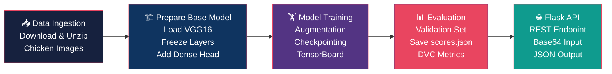
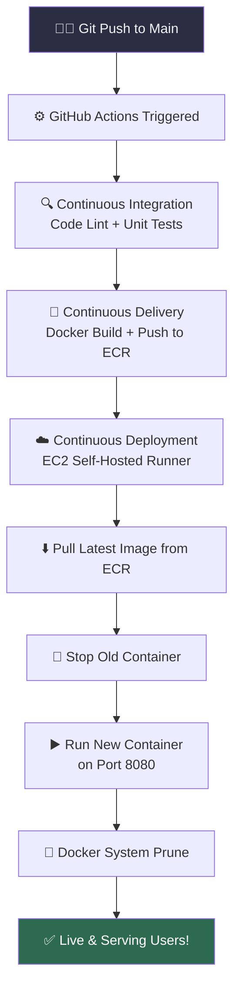

<div align="center">

<!-- Animated Header -->


<!-- Typing Animation -->
<a href="https://git.io/typing-svg">
  
</a>

<br/><br/>

<!-- Badges -->


<br/>


</div>

---

## 🌟 About The Project

> **An end-to-end MLOps pipeline for automated detection of Coccidiosis disease in poultry farms using Deep Learning — from data ingestion to cloud deployment.**

Coccidiosis is one of the most economically devastating diseases in the poultry industry, causing significant losses worldwide. This project tackles that problem with a production-grade AI system that classifies chicken fecal images as either **Coccidiosis-infected** or **Healthy** — enabling farmers to detect disease early and prevent widespread outbreak.

What makes this project stand out is not just the model, but the **complete MLOps infrastructure** built around it:
- ⚙️ Reproducible DVC-managed pipelines
- 🔁 Automated CI/CD from code push to cloud deployment
- 🐳 Docker containerization for environment consistency
- ☁️ AWS-native deployment with ECR + EC2
- 🌐 REST API for real-time inference

---

## 📸 Project Highlights

<div align="center">

| 🎯 Problem | 🔬 Approach | 🏆 Result |
|:---:|:---:|:---:|
| Coccidiosis detection in poultry | VGG16 Transfer Learning | **86.2% Accuracy** |
| Manual inspection is slow & costly | Automated image classification | Real-time REST API |
| No reproducibility in experiments | DVC pipeline versioning | Fully reproducible runs |
| Manual deployments are error-prone | GitHub Actions CI/CD | Push-to-deploy automation |

</div>

---

## 🏗️ System Architecture

```
┌─────────────────────────────────────────────────────────────────┐
│                     🐔 DISEASE CLASSIFIER SYSTEM                 │
├─────────────────────────────────────────────────────────────────┤
│                                                                   │
│  📦 DATA LAYER              🧠 MODEL LAYER                       │
│  ┌──────────────┐           ┌─────────────────────────────┐      │
│  │ Data Source  │──────────▶│  VGG16 (ImageNet weights)   │      │
│  │ (GitHub URL) │           │  + Custom Dense Head (x2)   │      │
│  └──────────────┘           │  + SGD Optimizer (lr=0.01)  │      │
│         │                   └─────────────────────────────┘      │
│         ▼                              │                          │
│  ┌──────────────┐                     ▼                          │
│  │ DVC Pipeline │           ┌─────────────────────────────┐      │
│  │  Stage 1: Data Ingest    │  Training Pipeline           │      │
│  │  Stage 2: Base Model     │  + TensorBoard Logging       │      │
│  │  Stage 3: Training  │    │  + Model Checkpointing       │      │
│  │  Stage 4: Evaluation│    │  + Data Augmentation         │      │
│  └──────────────┘           └─────────────────────────────┘      │
│                                                                   │
│  🚀 DEPLOYMENT LAYER                                             │
│  ┌──────────────────────────────────────────────────────────┐    │
│  │  GitHub Push → CI (Lint/Test) → Docker Build → ECR Push  │    │
│  │  → EC2 Pull → Container Run → Flask API (port 8080) ✅   │    │
│  └──────────────────────────────────────────────────────────┘    │
│                                                                   │
└─────────────────────────────────────────────────────────────────┘
```

---

## 🔄 ML Pipeline (DVC)



---

## 🚀 CI/CD Pipeline



---

## 📂 Project Structure

```
dlops_ba_p/
│
├── 📁 .github/
│   └── workflows/
│       └── main.yaml              # CI/CD GitHub Actions pipeline
│
├── 📁 .dvc/                       # DVC configuration
│
├── 📁 artifacts/                  # Auto-generated model artifacts
│   ├── data_ingestion/            # Raw downloaded dataset
│   ├── prepare_base_model/        # VGG16 base + updated models (.h5)
│   ├── prepare_callbacks/         # TensorBoard logs + checkpoints
│   └── training/                  # Final trained model
│
├── 📁 config/
│   └── config.yaml                # All path & URL configurations
│
├── 📁 research/                   # Jupyter notebooks (exploration)
│   ├── data_ingestion.ipynb
│   ├── prepare_base_model.ipynb
│   ├── training.ipynb
│   └── 05_model_evaluation.ipynb
│
├── 📁 src/cnnClassifier/
│   ├── components/                # Core ML components
│   │   ├── data_ingestion.py
│   │   ├── prepare_base_model.py  # VGG16 transfer learning
│   │   ├── prepare_callbacks.py   # TensorBoard + checkpointing
│   │   ├── training.py
│   │   └── evaluation.py
│   ├── pipeline/                  # Stage orchestrators
│   │   ├── stage_01_data_ingestion.py
│   │   ├── stage_02_prepare_base_model.py
│   │   ├── stage_03_training.py
│   │   ├── stage_04_evaluation.py
│   │   └── predict.py             # Inference pipeline
│   └── utils/common.py
│
├── 📄 app.py                      # Flask REST API server
├── 📄 main.py                     # Full pipeline runner
├── 📄 dvc.yaml                    # DVC stage definitions
├── 📄 dvc.lock                    # Locked dependency graph
├── 📄 params.yaml                 # Hyperparameters
├── 📄 scores.json                 # Model evaluation metrics
├── 📄 Dockerfile                  # Container definition
├── 📄 requirements.txt
└── 📄 pyproject.toml
```

---

## 🧠 Model Architecture

<div align="center">

| Layer | Details |
|:------|:--------|
| **Base** | VGG16 (pre-trained on ImageNet) |
| **Input Shape** | 224 × 224 × 3 |
| **VGG16 Layers** | All frozen (transfer learning) |
| **Custom Head** | Flatten → Dense(2, softmax) |
| **Optimizer** | SGD (lr = 0.01) |
| **Loss** | Categorical Crossentropy |
| **Classes** | Coccidiosis / Healthy |
| **Augmentation** | Enabled (rotation, flip, zoom) |
| **Batch Size** | 16 |

</div>

### 📊 Model Performance

```
┌─────────────────────────────┐
│     EVALUATION RESULTS      │
├──────────────┬──────────────┤
│   Accuracy   │    86.21%    │
│   Loss       │    3.1287    │
│   Val Split  │    30%       │
└──────────────┴──────────────┘
```

---

## ⚡ Quick Start

### Prerequisites

 
 


### 1️⃣ Clone the Repository

```bash
git clone https://github.com/<techakash32>/dlops_ba_p.git
cd dlops_ba_p
```

### 2️⃣ Create Virtual Environment

```bash
python -m venv venv

# Windows
venv\Scripts\activate

# macOS/Linux
source venv/bin/activate
```

### 3️⃣ Install Dependencies

```bash
pip install -r requirements.txt
pip install -e .
```

### 4️⃣ Run the Full DVC Pipeline

```bash
dvc repro
```

> This runs all 4 stages: Data Ingestion → Prepare Base Model → Training → Evaluation

### 5️⃣ Launch the Flask API

```bash
python app.py
```

The API will be live at `http://localhost:8080`

---

## 🌐 API Reference

### `GET /`
Returns the web UI homepage.

### `POST /predict`
Classifies a chicken fecal image.

**Request Body:**
```json
{
  "image": "<base64-encoded-image-string>"
}
```

**Response:**
```json
[
  { "image": "Coccidiosis" }
]
```

### `GET /train` or `POST /train`
Triggers a full model retraining pipeline.

```bash
# Example prediction using curl
curl -X POST http://localhost:8080/predict \
  -H "Content-Type: application/json" \
  -d '{"image": "<base64_string>"}'
```

---

## 🐳 Docker

### Build & Run Locally

```bash
# Build the Docker image
docker build -t chicken-disease-classifier .

# Run the container
docker run -p 8080:8080 chicken-disease-classifier
```

### Pull from AWS ECR

```bash
# Authenticate
aws ecr get-login-password --region <region> | \
  docker login --username AWS --password-stdin <ecr-uri>

# Pull and run
docker pull <ecr-uri>/<repo-name>:latest
docker run -d -p 8080:8080 <ecr-uri>/<repo-name>:latest
```

---

## ☁️ AWS Deployment Guide

### Required GitHub Secrets

Go to **Repository → Settings → Secrets & Variables → Actions** and add:

| Secret | Description |
|--------|-------------|
| `AWS_ACCESS_KEY_ID` | IAM user access key |
| `AWS_SECRET_ACCESS_KEY` | IAM user secret key |
| `AWS_REGION` | e.g., `ap-south-1` |
| `ECR_REPOSITORY_NAME` | Your ECR repo name |

### Self-Hosted Runner (EC2)

1. Launch an EC2 instance (Ubuntu 22.04 recommended)
2. Install Docker on the instance
3. Go to **Repo → Settings → Actions → Runners → New Self-Hosted Runner**
4. Follow the setup script on your EC2 instance
5. Push to `main` branch — deployment happens automatically 🎉

---

## 📈 Experiment Tracking

### DVC Metrics

```bash
# View tracked metrics
dvc metrics show

# Compare across git commits
dvc metrics diff
```

### TensorBoard

```bash
tensorboard --logdir artifacts/prepare_callbacks/tensorboard_log_dir
```

Open `http://localhost:6006` to see training curves.

---

## 🔧 Configuration

All configuration is managed via two files:

**`config/config.yaml`** — Paths & URLs:
```yaml
data_ingestion:
  source_URL: https://raw.githubusercontent.com/...
  local_data_file: artifacts/data_ingestion/data.zip

prepare_base_model:
  base_model_path: artifacts/prepare_base_model/base_model.h5
```

**`params.yaml`** — Hyperparameters:
```yaml
IMAGE_SIZE: [224, 224, 3]
BATCH_SIZE: 16
EPOCHS: 1
LEARNING_RATE: 0.01
AUGMENTATION: True
CLASSES: 2
WEIGHTS: imagenet
```

---

## 🛠️ Tech Stack

<div align="center">

| Category | Technology |
|:---------|:-----------|
| **Deep Learning** | TensorFlow 2.x, Keras, VGG16 |
| **Pipeline & Versioning** | DVC (Data Version Control) |
| **Experiment Tracking** | TensorBoard |
| **API Framework** | Flask + Flask-CORS |
| **Containerization** | Docker |
| **CI/CD** | GitHub Actions |
| **Cloud Registry** | AWS ECR (Elastic Container Registry) |
| **Cloud Compute** | AWS EC2 (Self-Hosted Runner) |
| **Config Management** | YAML (config.yaml + params.yaml) |
| **Language** | Python 3.12 |

</div>

---

## 🚧 Future Improvements

- [ ] 🔢 Increase training epochs for better accuracy
- [ ] 📊 Integrate MLflow for richer experiment tracking
- [ ] 🧪 Add real unit tests to CI pipeline (currently placeholder)
- [ ] 🖼️ Build a Streamlit frontend for easy demo
- [ ] 📱 Export model to TensorFlow Lite for mobile inference
- [ ] 📦 Add multi-class support (Salmonella, Newcastle Disease, etc.)
- [ ] 🔔 Add Slack/email alerts on deployment failure

---

## 🤝 Contributing

Contributions are welcome! Here's how:

```bash
# Fork the repo, then:
git checkout -b feature/your-feature-name
git commit -m "feat: add your feature"
git push origin feature/your-feature-name
# Open a Pull Request 🚀
```

---

## 📄 License

Distributed under the MIT License. See `LICENSE` for more information.

---

<div align="center">

<!-- Footer Wave -->


**Built with ❤️ | Deep Learning × MLOps × Cloud**

*Star ⭐ this repo if you found it useful!*

[](https://github.com/yourusername/dlops_ba_p)

</div>
